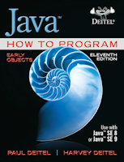
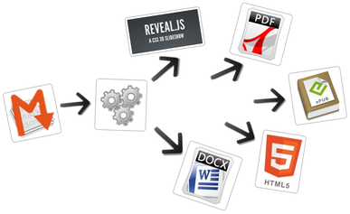

# Introduction to Computers, the Internet and Java

## [Slides: Introduction to Computers, the Internet and Java](html/intro-pro-reveal-slides.html)

Slides based on [**Chapter 1: Introduction to Computers, the Internet and Java**](https://media.pearsoncmg.com/ph/esm/deitel/java_htpeo_11/cw/content/sample-chapters/jhtp_01_Intro.pdf) of the book [Java How to Program: Early Objects, 11/E](http://www.deitel.com/Books/Java/JavaHowtoProgram11e/tabid/3683/Default.aspx).	

Slide presentation made with [**MarkdownSlides**](https://github.com/asanzdiego/markdownslides) <https://github.com/asanzdiego/markdownslides>: a script to create slides from MD files.

**MarkdownSlides program source code are licensed under a [GPL 3.0](http://www.gnu.org/licenses/gpl.html)**

**[reveal.js](https://github.com/hakimel/reveal.js/) is under [MIT License](https://github.com/hakimel/reveal.js/#license)**
	

### [intro-pro-book.html](html/intro-pro-book.html) include Back to Top code:

- [Using jQuery to add a dynamic "Back To Top" floating button with smooth scroll](http://www.developerdrive.com/2013/07/using-jquery-to-add-a-dynamic-back-to-top-floating-button-with-smooth-scroll/)
